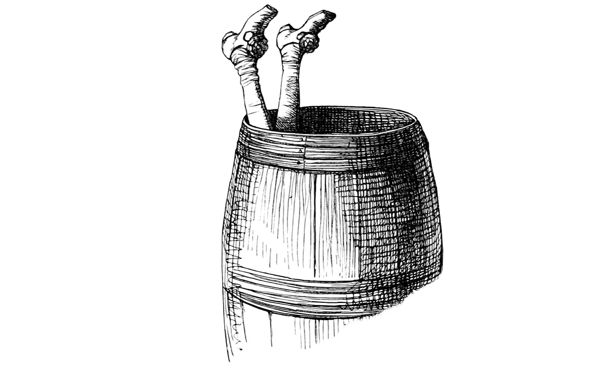
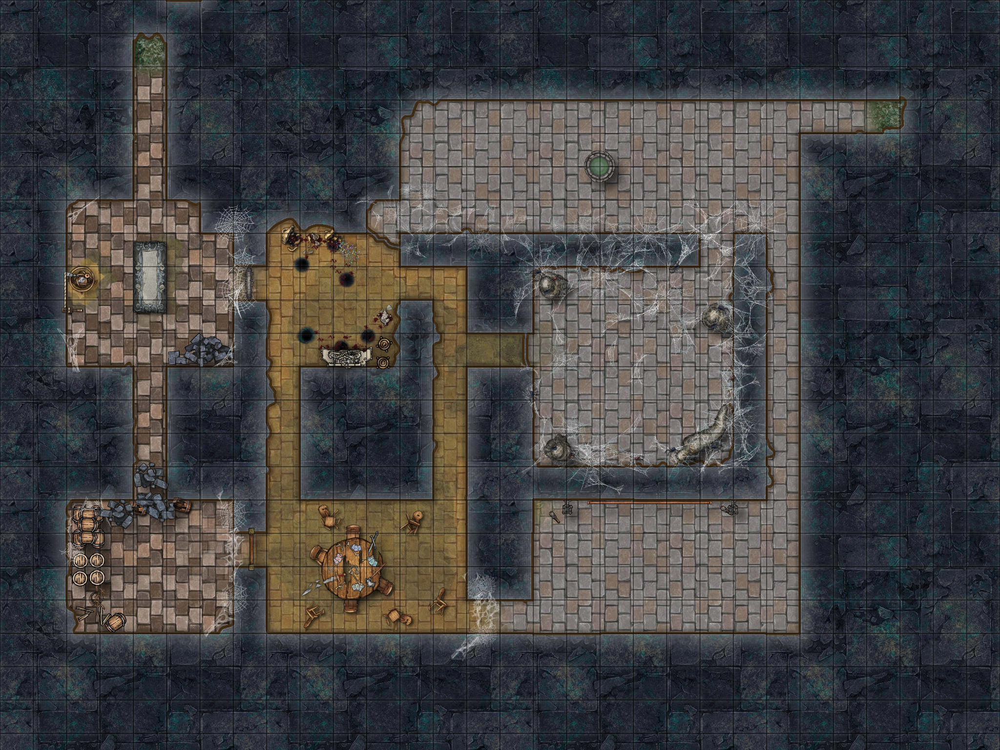

# Le Tertre du Roi des Elfes / *Barrow of the Elf King*

Par [Highland Paranormal Society](https://www.dungeonresearch.com/), traduit et converti pour [Cairn](https://cairnrpg.com/) par LeCrapal.

*Un terrain d'exploration pour les jeux de rôle fantasy sur table. Suggéré pour un groupe de 3-4 aventuriers de niveau 1.*

## Au plus profond de la Vieille Forêt,

là où les arbres sont grands et épais, là où le soleil perce rarement la canopée, se trouve un monticule de terre. Aucun oiseau ne chante dans cette partie de la forêt, aucun vent ne souffle. Les feuilles des arbres semblent plus grandes, la canopée plus épaisse. Même à la mi-journée, il fait presque trop sombre pour y voir.

## 1. Le cairn effondré

À côté du monticule se trouvent trois pierres lisses, de forme identique mais de taille différente. La plus grande est trop lourde pour être déplacée par moins de trois personnes, la suivante en nécessite deux, et la plus petite peut être soulevée par une seule personne. Si les pierres sont empilées les unes sur les autres, une entrée s'ouvre sur le côté nord du monticule.

## 2. Le tunnel des domestiques

Un étroit tunnel en briques de pierre est bordé de petites alcôves, deux de chaque côté. Chacune contient un crâne, recouvert de marques ornementales à l'encre bleue, avec des pierres précieuses vertes *(25 po chacune)* encastrés dans les orbites. Trois des crânes ont les grandes orbites et les traits acérés des anciens Elfes. L'autre est plus grand, mais avec des yeux plus petits et des défenses d'un Orc. L'une des défenses est en or. *(20 po)*. Un explorateur averti pourrait discerner qu'il s'agit des restes de serviteurs de haut statut, pour avoir une sépulture aussi noble. Un fil d'argent caché est attaché à l'intérieur de chaque crâne, les fils vont dans des trous sous les crânes. Si on soulève un crâne sans couper le fil, le tunnel s'effondre. Les PJ doivent faire une *Sauvegarde de Dextérité* ou subir 3d6 dégâts (moins l'Armure). 
**Entrées:** *L'extrémité nord du tunnel débouche sur le cairn dans la forêt. L'extrémité sud du tunnel débouche sur la salle 3.*

## 3. La dalle funéraire

Le squelette d'un roi elfe repose sur une dalle de pierre. Il est vêtu d'une armure en bois blanc *(moyenne)* et d'une couronne de branches blanches torsadées d'où poussent des feuilles vertes. Ses bras croisés tiennent deux flèches en fer noir. Un grand sablier est suspendu à de lourdes chaînes sur un système de poulies. Une manivelle en fer le fait tourner. Lorsque le sable commence à tomber, le fantôme du roi des elfes sort du squelette, armé d'une grande épée en bois blanc. Il n'apprécie guère les intrus dans sa tombe, où il attend la résurrection lorsque l'univers renaîtra. Il ne sait rien de l'araignée, des vers ou de tout autre intrus. Le sablier ne met que dix minutes à s'épuiser. Le fantôme disparaît lorsque le sable cesse de tomber ou si le sablier est cassé. Si le fantôme est vaincu au combat, il disparaît en laissant son épée derrière lui. 
**Entrées:** *Une ouverture dans le mur nord mène à la salle 2. Une porte verrouillée sur le mur est mène à la salle 6. Un tunnel dans le mur sud mène à la salle 4.*

## 4. Gobelin dans un tonneau

On peut entendre des sanglots étouffés et des éternuements intermittents provenant d'un tonneau pourri. Wogwurt, un petit gobelin, se cache à l'intérieur, portant un bol en bois en guise de casque, une fausse moustache faite de feuilles, et tenant une épée jouet faite de deux bâtons attachés ensemble. Elle s'est perdue dans la forêt et s'est aventurée dans le monticule à travers le Grand Chêne. *(Salle 10)* et ne se souvient pas de la sortie. Elle est terrifiée et légèrement allergique à la poussière de la tombe. Sa famille est bergère de crapauds dans une tourbière voisine et récompensera ses sauveteurs par un destrier crapaud. 
**Entrées:** *Le tunnel dans le mur nord mène à la salle 3. La porte en bois sur le mur est mène à la salle 5.*

## 5. La salle de garde

Trois squelettes vêtus d'armures rouillées plus ou moins complètes lancent des dés à une petite table. Ils misent des pièces d'armure et même leurs os s'ils ont perdu toute leur armure. Un ancien enchantement les a liés ici pour protéger la tombe mais la magie s'est érodée avec le temps et ils s'ennuient terriblement. Ils demandent à demi-mot aux intrus de partir et mettent fin à toute conversation avec *“Ok, c'est l'heure de partir.”* ou *“Il se fait tard”* en faisant un geste vers l'entrée. S'ils sont détruits, ils se réassembleront dans une semaine. Un quatrième garde squelette est coincé dans la toile d'araignée de la salle 7. Il a peur de l'araignée. Si leur compagnon est secouru ou si leur ennui est dissipé, ils révéleront qu'un coffre à clé se trouve au fond du puits de la salle 9, mais que l'eau est un acide magique qui dissout tous les objets qu'il touche, mais ne blesse ni la chair ni les os. 
**Entrées:** *Le tunnel dans le coin nord-ouest mène à la salle 6. Le tunnel de l'angle nord-est mène aux salles 6 et 7. Le tunnel de l'angle sud-est mène à la salle 8.*

## 6. Stockage des organes royaux

1d6+1 vers ont creusé le sol et se nourrissent d'organes momifiés. Des urnes brisées et des organes desséchés jonchent le sol. Il reste deux urnes intactes, l'une contient le cœur du Roi des Elfes et l'autre son cerveau, suspendu dans une gelée magique qui l'empêche de se décomposer. 
**Entrées:** *La porte verrouillée dans le mur ouest mène à la salle 3. Le faux mur dans l'angle nord-est s'ouvre sur la salle 9. Le tunnel dans le mur est mène aux salles 5 et 7. Le tunnel dans le mur sud mène à la salle 5.*

## 7. La demeure de l'araignée

Des toiles d'araignées recouvrent les murs. Les pièges des toiles collantes doivent être soigneusement évités ou une *Sauvegarde de Force* sera nécessaire pour se libérer. Sargmotra Sinspinner, la plus vieille araignée de la forêt, a fait de cette chambre son repaire. Quatre sacs de toile pendent du plafond. Deux contiennent des cerfs desséchés, un contient un bûcheron mort avec une hache et 4d4 po, et un contient un garde squelettique piégé. Sargmotra désire manger tous les êtres vivants mais préfère d'abord jouer avec eux. Il offrira d'épargner ceux qui le serviront. Les serviteurs de Sargmotra sont mordus et reçoivent la bénédiction de l'araignée. Cela leur permet de grimper aux murs et aux plafonds à la moitié de leur vitesse et de voir dans le noir. En échange, ils doivent apporter à Sargmotra un être vivant à manger chaque mois. La Bénédiction doit être renouvelée tous les mois ou ils tombent malades et, à moins qu'ils ne réussissent un jet de sauvegarde de VOL, meurent après trois jours.
 **Entrées:** *Le tunnel dans le mur ouest mène aux salles 5 et 6, le tunnel dans le coin sud-est mène à la salle 8, le tunnel caché par la toile dans le coin nord-est mène à la salle 9.*

## 8. La tapisserie

Une tapisserie animée recouvre le mur sud. Les images bougent comme si elles étaient vivantes. Elle dépeint les légendaires Elflands : des elfes dansant en cercle, des oiseaux volant, des arbres se balançant dans le vent, un guerrier en armure combattant un dragon rouge sang. La tapisserie vaut 500 po pour la plupart des marchands d'art mais pourrait valoir plusieurs fois cette somme pour un collectionneur particulier. Deux personnes pourraient la porter si elle était enroulée. Chaque PJ voit ses PV réduits à 0 pendant qu'il porte la tapisserie. 
**Entrées :** *Le tunnel dans le mur ouest mène à la salle 5. Le tunnel dans le mur nord mène à la salle 7. Le tunnel dans le coin nord-est mène à la salle 9.*

## 9. Puits du trésor

Un puits au milieu de la pièce est rempli d'acide magique. Il n'endommage pas la chair et les os mais dissout tous les objets non vivants. Il y a un coffre contenant 500 po de pierres précieuses au fond qui est immunisé contre l'acide. 1d6 araignées construisent une toile à travers le tunnel du mur Est. L'air frais s'écoule doucement de ce tunnel. 
**Entrées:** *Le faux mur mène à la salle 6. Un tunnel couvert de toile mène à la salle 7. Un tunnel dans le mur est mène à la salle 10. Le tunnel dans le coin sud-est mène à la salle 8.*

## 10. Le Grand Chêne.

Le tunnel de la salle 9 se termine à l'intérieur de ce grand chêne. Un trou dans le chêne donne sur la forêt. Le trou est juste assez grand pour qu'une personne puisse s'y glisser. Les paquets et les gros objets doivent être passés séparément. 
**Entrées** : *Le tunnel va vers l'ouest jusqu'à la salle 9. Un trou à l'est donne sur la forêt.*  

# Trésors

1. **Flèche noire :** **attaques renforcées** contre les dragons, d'une valeur de 25 po chacune.
2. **Couronne de branches blanches :** Le porteur peut communiquer par télépathie avec les créatures des bois. D'une valeur de 250 po.
3. **Grande épée en bois blanc (d10) :** Ne se détériore jamais. S'il est planté, il deviendra en un an un chêne blanc géant avec une porte vers le pays des fées. D'une valeur de 150 po.
4. **Tapisserie :** Des images magiques animées montrent le mythique pays des fées. Peut-être qu'un magicien habile pourra trouver des indices sur l'endroit où se trouve le pays mythique caché dans la tapisserie.
5. **Dés usés du squelette :** Chuchotez un chiffre aux dés et c'est sur ce chiffre qu'ils tomberont.
6. **Le cœur du roi des elfes :** Le consommer guérit toutes blessures (PV & FOR au max, supprime fatigue et carence). Vaut 200 po pour les nécromanciens.
7. **Le cerveau du roi des elfes :** Le consommer permet d'apprendre un sort aléatoire. Un livre de sorts en bois se manifeste, que seul le ou les mangeurs peuvent lire. Faites un jet sur la table des livres de sorts standard ou supplémentaires. Vaut 400 po pour les nécromanciens. 

# Bestiaire

**Garde Squelette** 5 PV, 1 Armure, 13 DEX, épée rouillée (d6)

**Gobelin** 2 PV, 8 FOR, 12 DEX, 8 VOL

**Ver du tertre** 2 PV, 1 Armure, 3 FOR, 12 DEX, 2 VOL, morsure (1d4)

**Sargmotra Sinspinner** 8 PV, 14 FOR, 13 DEX, 12 VOL, morsure (d10)

- Toile : La cible est prise et incapable de bouger. Une sauvegarde FOR réussie est nécessaire pour se libérer.
- Dégâts critiques : boit le sang de la cible et soigne 1d6 FOR.

**Araignées** 4 PV, 10 FOR, 11 DEX, 4 VOL, morsure (d6)

- Peut grimper aux murs et au plafond.

**Roi des Elfes** 6 PV, 2 Armure, 11 FOR, 13 DEX, 3 VOL, grande épée en bois blanc (d10)

- Peut se téléporter dans un rayon de 5 mètres.

# Carte

